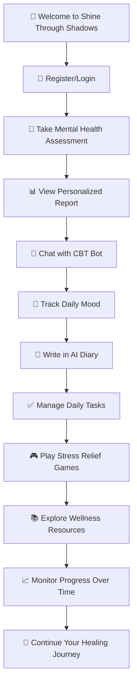

<div align="center">

# 🌟✨ **SHINE THROUGH SHADOWS** ✨🌟

### 🧠💫 *AI-Powered Mental Health Companion* 💫🧠

[](https://github.com/KATTASATWIKA/shine-through-shadows)
[](https://nodejs.org/)
[](https://mongodb.com/)
[](https://ai.google.dev/)
[](https://github.com/KATTASATWIKA/shine-through-shadows)

---


</div>

## 📋 **TABLE OF CONTENTS**

- [🎯 Overview](#-overview)
- [🖥️ Dashboard Preview](#️-dashboard-preview)
- [🚀 Features](#-features)
- [🛠️ Tech Stack](#️-tech-stack)
- [⚙️ Setup Guide](#️-setup-guide)
- [📬 API Documentation](#-api-documentation)
- [🎮 Usage Flow](#-usage-flow)
- [🙌 Credits](#-credits)
- [🔮 Future Plans](#-future-plans)

---

## 🎯 **OVERVIEW**

<div align="center">

> *"In the midst of winter, I found there was, within me, an invincible summer."* - Albert Camus

</div>

Mental health is a **silent crisis** in India. The numbers tell a sobering story:

| 📊 **Statistic** | 📈 **Impact** |
|------------------|---------------|
| 🏥 **197 million** people affected | **1 in 7** Indians suffer from mental disorders |
| 😔 **56 million** with depression | Equivalent to the population of South Korea |
| 😰 **38 million** with anxiety | More than Canada's entire population |
| 👨‍⚕️ **0.75 psychiatrists** per 100,000 | **4x less** than WHO recommendations |

**Shine Through Shadows** bridges this gap with:
- 🤖 **AI-powered assessments** and therapy
- 📱 **24/7 accessibility** and anonymity  
- 🎯 **Personalized interventions** based on CBT principles
- 🌱 **Holistic wellbeing** through mood tracking and mindfulness


---

## 🖥️ **📋 DASHBOARD PREVIEW**

<div align="center">


</div>

After login, users access a comprehensive, intuitive dashboard designed for emotional wellbeing:

<table>
<tr>
<td width="50%">

#### 🧠 **Full Dashboard Experience**


</td>
<td width="50%">

#### 📈 **Mood Analytics & Insights**


</td>
</tr>
</table>

#### 📝 **Activity Hub & Smart Recommendations**


---

## 🚀 **FEATURES**

<div align="center">

### 🌟 *Comprehensive Mental Health Toolkit* 🌟

</div>

### 🧠 **🎯 Depression Assessment & AI Report Generation**

<table>
<tr>
<td width="60%">

**🔍 Evidence-Based Assessment:**
- ✅ Clinically-validated questionnaire
- 📊 **5-tier classification system:**
  - 🟢 **Minimal** - You're doing great!
  - 🟡 **Mild** - Small steps needed
  - 🟠 **Moderate** - Time for action
  - 🔴 **Moderately Severe** - Seek support
  - ⚫ **Severe** - Immediate attention required

**📋 Comprehensive Report Includes:**
-  Personalized summary & analysis
-  Risk level assessment
-  Actionable recommendations
-  Detailed symptom breakdown

</td>
<td width="40%">


</td>
</tr>
</table>

---

### 💬 **🤖 CBT Chatbot (Powered by Google Gemini AI)**

<table>
<tr>
<td width="40%">


</td>
<td width="60%">

**🧘‍♀️ Cognitive Behavioral Therapy at Your Fingertips:**

-  **Empathetic validation** of your feelings
-  **Identifies cognitive distortions** automatically
-  **Reframes negative thoughts** into balanced perspectives
-  **Provides actionable suggestions** for improvement
-  **Concise responses** (under 100 words) for easy digestion

*"Your thoughts create your reality. Let's reshape them together."*

</td>
</tr>
</table>

---

### 📔 **📊 Advanced Mood Tracking System**

<div align="center">

#### 🎭 *Track Your Emotional Journey* 🎭

</div>

<table>
<tr>
<td width="50%">


**📝 Daily Mood Logging:**
-  Emoji-based mood selection
-  Personal notes & reflections  
- 🏷 Custom labels & categories
-  One entry per day rule

</td>
<td width="50%">


**📈 Historical Analysis:**
-  Visual pattern recognition
-  Weekly/monthly trends
-  Trigger identification
-  Personalized insights

</td>
</tr>
</table>

---

### 📒 **✨ AI-Powered Diary with Sentiment Reframing**

<table>
<tr>
<td width="35%">


</td>
<td width="35%">


</td>
<td width="30%">

**🔄 Transform Negativity into Growth:**

-  **Original entries** preserved
-  **AI reframing** of negative thoughts
-  **Positive perspective** generation
-  **Dual storage** system
-  **Growth mindset** cultivation

*Turn your struggles into strength!*

</td>
</tr>
</table>

---

### ✅ **🎯 Gamified Daily Task Management**


<div align="center">

| 🎮 **Feature** | 📈 **Benefit** | 🏆 **Reward** |
|----------------|----------------|---------------|
| ✅ Task completion | Builds routine | **+10 XP** per task |
| 🔥 Streak tracking | Maintains momentum | **Bonus multipliers** |
| 📅 Date grouping | Visual progress | **Achievement badges** |
| ⏰ Time management | Better planning | **Productivity insights** |

</div>

---

### 🧩 **🎮 Therapeutic Stress Relief Games**


<div align="center">

#### 🌊 *Find Peace Through Play* 🌊

</div>

| 🎮 **Game** | 🎯 **Purpose** | 🧘‍♀️ **Benefit** |
|-------------|----------------|-------------------|
| 🌊 **Ripple Garden** | Tap to create calming water ripples | Mindfulness & focus |
| 🎨 **Flow Art** | Draw therapeutic flowing patterns | Creative expression |
| 🌊 **Ocean of Wisdom** | Floating inspirational quotes | Motivation & peace |
| 🫁 **Breathing Circle** | Guided breathing visualization | Anxiety reduction |

---

### 📚 **🎯 Personalized Wellness Resources**

<table>
<tr>
<td width="50%">


</td>
<td width="50%">


</td>
</tr>
</table>

**🎨 Content Tailored to Your Mental Health Level:**

-  **Articles** - Evidence-based mental health insights
-  **Videos** - Guided meditations & therapy sessions  
-  **Audio** - Calming music & mindfulness podcasts
-  **Community** - Support groups & peer connections

---

### 👤 **🔐 Secure User Authentication**

<table>
<tr>
<td width="40%">


</td>
<td width="40%">


</td>
<td width="20%">

**🛡️ Data Protection:**
-  Encrypted storage
-  Secure authentication  
-  Complete data history
-  Cross-session continuity

</td>
</tr>
</table>

---

## 🛠️ **TECH STACK**

<div align="center">

### ⚡ *Built with Modern, Reliable Technologies* ⚡

</div>

<table align="center">
<tr>
<td align="center" width="25%">

### 🖥️ **Backend**


</td>
<td align="center" width="25%">

### 🗄️ **Database** 


</td>
<td align="center" width="25%">

### 🤖 **AI/ML**


</td>
<td align="center" width="25%">

### 🎨 **Frontend**


</td>
</tr>
</table>

---

## ⚙️ **SETUP GUIDE**

<div align="center">

### 🚀 *Get Started in Minutes* 🚀

</div>

### ✅ **Prerequisites**

<table>
<tr>
<td width="33%" align="center">


</td>
<td width="33%" align="center">


</td>
<td width="33%" align="center">


</td>
</tr>
</table>

### 📦 **Quick Installation**

```bash
# 📥 Clone the repository
git clone https://github.com/KATTASATWIKA/shine-through-shadows.git

# 📂 Navigate to project directory  
cd shine-through-shadows

# 📦 Install dependencies
npm install
```

### 🔑 **Environment Configuration**

Create a `.env` file in the root directory:

```env
# 🤖 AI Configuration
GOOGLE_API_KEY=your_google_generative_ai_key_here

# 🌐 Server Configuration  
PORT=3000

# 🗄️ Database Configuration
MONGODB_URI=mongodb://localhost:27017/shadowsDB
```

### ▶️ **Launch the Application**

```bash
# 🛠️ Start MongoDB service
mongod

# 🚀 Launch the server
node server.js

# 🌐 Access at: http://localhost:3000
```

<div align="center">

🎉 **Congratulations! Your mental health companion is ready!** 🎉

</div>

---

## 📬 **API DOCUMENTATION**

<div align="center">

### 🔌 *RESTful API Endpoints* 🔌

</div>

| 🔗 **METHOD** | 📍 **ENDPOINT** | 📋 **DESCRIPTION** | 🎯 **PURPOSE** |
|---------------|-----------------|-------------------|----------------|
| 📝 **POST** | `/api/register` | Register new user | 👤 User onboarding |
| 🔐 **POST** | `/api/login` | Authenticate user | 🔑 Secure access |
| 📊 **POST** | `/api/submit-quiz` | Submit depression assessment | 🧠 Mental health evaluation |
| 💬 **POST** | `/api/chat` | Get CBT chatbot response | 🤖 AI therapy session |
| 📖 **POST** | `/api/diary` | Reframe diary entry | ✨ Sentiment transformation |
| 📚 **GET** | `/api/diary/:email` | Fetch user diary entries | 📖 Personal history |
| 😊 **POST** | `/api/mood` | Log daily mood | 📊 Mood tracking |
| 📈 **GET** | `/api/mood-history/:email` | Get mood analytics | 📊 Historical insights |
| ✅ **POST** | `/api/tasks` | Add/update tasks | 🎯 Goal management |
| 📋 **GET** | `/api/tasks/:email` | Get task analytics | 📊 Progress tracking |
| 💾 **POST** | `/api/cbt-report` | Save CBT session | 🧠 Therapy records |
| 📑 **GET** | `/api/cbt-reports/:email` | Get CBT history | 📚 Session analytics |

---

## 🎮 **USAGE FLOW**

<div align="center">

### 🗺️ *Your Journey to Better Mental Health* 🗺️

</div>



<div align="center">

**🌈 Every step forward is a victory worth celebrating! 🌈**

</div>

---

## 🙌 **CREDITS & ACKNOWLEDGMENTS**

<div align="center">


</div>

<table>
<tr>
<td width="50%">

#### 🛠️ **Technologies & Libraries**
- 🚀 [Express.js](https://expressjs.com) - Fast web framework
- 🗄️ [MongoDB](https://mongodb.com) + [Mongoose](https://mongoosejs.com) - Database excellence  
- 🤖 [Google Gemini AI](https://ai.google.dev) - Intelligent conversations
- 🎨 Modern HTML/CSS/JavaScript - Beautiful interfaces

</td>
<td width="50%">

#### 🌟 **Special Thanks**
- 💚 **Mental health advocates** worldwide
- 🏥 **WHO & NIMHANS** for critical statistics  
- 👥 **Open source community** for inspiration
- 🧠 **CBT therapy principles** for guidance
- ❤️ **Everyone fighting mental health stigma**

</td>
</tr>
</table>

<div align="center">

</div>

---

## 🔮 **FUTURE ROADMAP**

<div align="center">

### 🚀 *Coming Soon: Even More Ways to Shine* 🚀

</div>

<table>
<tr>
<td width="25%" align="center">

### 📊 **Phase 1**
-  Advanced analytics dashboard
-  Email reminder notifications  
-  Goal-setting framework
-  Mobile responsiveness

</td>
<td width="25%" align="center">

### 👨‍⚕️ **Phase 2**  
-  Live therapist chat integration
-  Video consultation booking
-  Healthcare provider network
-  Professional referrals

</td>
<td width="25%" align="center">

### 🔐 **Phase 3**
-  OAuth login (Google/Discord)
-  Multi-device synchronization  
-  Multi-language support
-  Enhanced accessibility

</td>
<td width="25%" align="center">

### 🤖 **Phase 4**
-  Advanced AI models
-  Predictive mental health analytics
-  Community features
-  Personalized therapy plans

</td>
</tr>
</table>

---

<div align="center">


[](https://github.com/KATTASATWIKA/shine-through-shadows)

</div>
